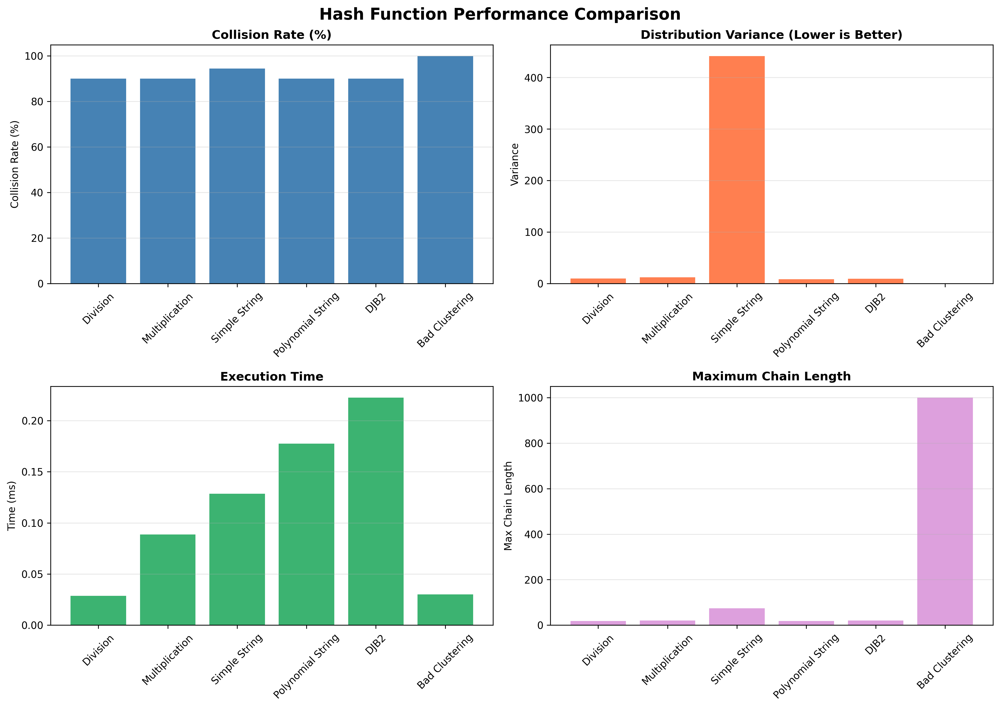
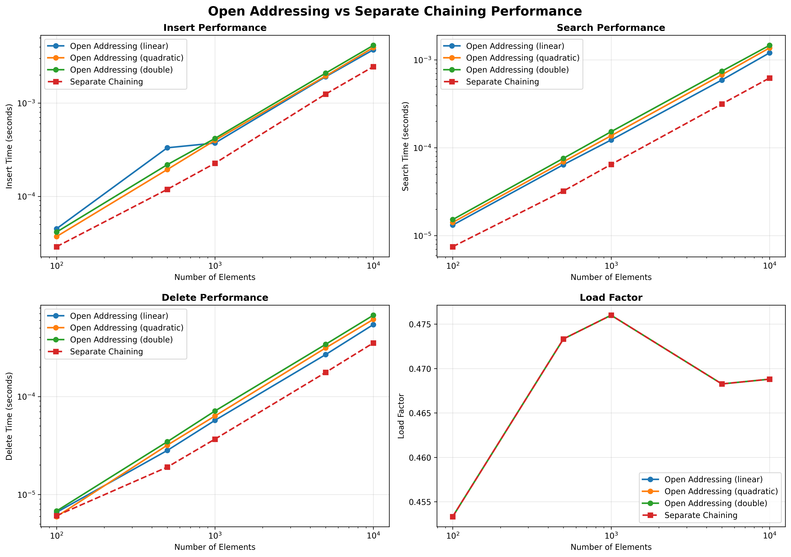
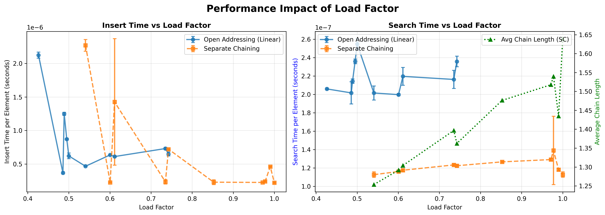
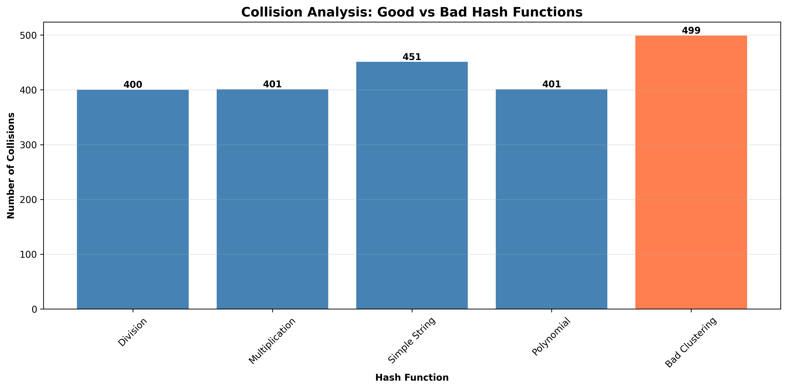

# MSCS532 Assignment 7: Hash Tables and Their Practical Applications

**Author:** Carlos Gutierrez  
**Email:** cgutierrez44833@ucumberlands.edu  
**Course:** MSCS532 – Data Structures and Algorithms  
**Assignment:** Hash Tables and Their Practical Applications

## Overview

This assignment provides a comprehensive study of hash tables, including direct-address tables, hash functions, open addressing, and separate chaining. It includes implementations of various hash table data structures, hash function designs (both good and bad examples), theoretical complexity analysis, empirical benchmarking, test coverage, and reproducible visualization assets.

## Repository Structure

```
MSCS532_Assignment7/
├── docs/
│   ├── hash_function_comparison.png      # Hash function performance comparison
│   ├── open_addressing_vs_chaining.png   # Collision resolution strategies comparison
│   ├── load_factor_impact.png            # Performance at different load factors
│   └── collision_analysis.png            # Collision analysis for different hash functions
├── examples/
│   ├── hash_tables_demo.py               # Hash table demonstrations
│   └── generate_plots.py                 # Script to reproduce all plots
├── src/
│   ├── hash_functions.py                 # Various hash function implementations
│   ├── hash_tables.py                    # Hash table data structures
│   ├── benchmark.py                      # Benchmarking utilities
│   └── __init__.py                       # Package initialization
├── tests/
│   ├── test_hash_functions.py            # Tests for hash functions
│   └── test_hash_tables.py               # Tests for hash tables
├── papers/                               # Reference papers (PDFs)
├── requirements.txt                      # Python dependencies
├── README.md                             # Project documentation (this file)
└── REPORT.md                             # Detailed analysis report

```

## Part 1: Hash Functions and Their Impact

### Implementation

#### Good Hash Functions

* **Division Method:** `h(k) = k mod m`
  * Simple and fast
  * Requires careful choice of table size (preferably prime)
  
* **Multiplication Method:** `h(k) = floor(m * (kA mod 1))`
  * Good distribution with proper choice of A
  * Default A = (√5 - 1)/2 ≈ 0.618
  
* **Universal Hash Functions:** `h(k) = ((a*k + b) mod p) mod m`
  * Minimizes collisions for any set of keys
  * Requires random parameters a, b and prime p
  
* **Polynomial String Hash:** Rolling hash for strings
  * Better distribution than simple summation
  * Base 31 is commonly used
  
* **DJB2 Hash:** Popular string hash function
  * Known for good distribution properties

#### Bad Hash Functions (Demonstration)

* **Simple String Hash:** Sums character values
  * Prone to collisions for similar strings
  * Poor distribution
  
* **Bad Clustering Hash:** Demonstrates clustering behavior
  * Causes many collisions and poor performance

### API Highlights

**Hash Functions:**

```python
division_hash(key: int, table_size: int) -> int
multiplication_hash(key: int, table_size: int, A: float) -> int
universal_hash(key: int, table_size: int, a: int, b: int, p: int) -> int
string_hash_polynomial(key: str, table_size: int, base: int) -> int
string_hash_simple(key: str, table_size: int) -> int  # BAD EXAMPLE
bad_hash_clustering(key: int, table_size: int) -> int  # BAD EXAMPLE
```

## Part 2: Hash Table Data Structures

### Implementation

#### Direct-Address Table

* **File:** `src/hash_tables.py`
* **Operations:** insert, search, delete
* **Time Complexity:** O(1) for all operations
* **Space Complexity:** O(m) where m is the key range
* **Use Case:** When keys are integers in a small known range

#### Open Addressing

* **File:** `src/hash_tables.py`
* **Probe Types:**
  * Linear Probing: `h(k,i) = (h'(k) + i) mod m`
  * Quadratic Probing: `h(k,i) = (h'(k) + c1*i + c2*i²) mod m`
  * Double Hashing: `h(k,i) = (h1(k) + i*h2(k)) mod m`
* **Operations:** insert, search, delete
* **Time Complexity:**
  * Best/Average: O(1)
  * Worst: O(n) due to clustering
* **Space Complexity:** O(n) where n is number of elements

#### Separate Chaining

* **File:** `src/hash_tables.py`
* **Implementation:** Each bucket contains a linked list
* **Operations:** insert, search, delete
* **Time Complexity:**
  * Best/Average: O(1)
  * Worst: O(n) if all keys hash to same bucket
* **Space Complexity:** O(n + m) where m is table size

### Theoretical Performance Analysis

| Operation | Direct-Address | Open Addressing | Separate Chaining |
|-----------|---------------|-----------------|-------------------|
| Search    | O(1)          | O(1) avg, O(n) worst | O(1) avg, O(n) worst |
| Insert    | O(1)          | O(1) avg, O(n) worst | O(1) avg, O(n) worst |
| Delete    | O(1)          | O(1) avg, O(n) worst | O(1) avg, O(n) worst |
| Space     | O(m)          | O(n)            | O(n + m)          |

**Key Insights:**

* **Direct-Address:** Fastest but requires keys in known range
* **Open Addressing:** Better cache performance, but clustering can degrade performance
* **Separate Chaining:** More robust to high load factors, easier deletion

## Getting Started

### Prerequisites

* Python 3.10 or later
* Recommended to use a virtual environment

### Installation

```bash
python -m venv .venv
source .venv/bin/activate  # On Windows: .venv\Scripts\activate
pip install -r requirements.txt
```

## Running the Examples

```bash
python examples/hash_tables_demo.py          # Hash table demonstrations
python examples/generate_plots.py            # Regenerate all figures in docs/
```

## Running Tests

```bash
python -m pytest
```

The test suite verifies correctness for:

* All hash function implementations
* Direct-address table
* Open addressing (all probe types)
* Separate chaining

## Reproducing the Empirical Study

1. Activate your environment and install dependencies.
2. Run `python examples/generate_plots.py`.  
   * Benchmarks may take several minutes depending on hardware.
3. Generated figures will be written to the `docs/` directory.

## Visualizations

The following visualizations demonstrate key findings from our empirical analysis:

### Hash Function Comparison



This visualization compares different hash functions across multiple metrics: collision rates, distribution variance, execution time, and maximum chain lengths. It clearly demonstrates the impact of hash function design on performance.

### Open Addressing vs. Separate Chaining



This comprehensive comparison shows insert, search, and delete performance across different data sizes for both open addressing (linear, quadratic, double hashing) and separate chaining methods.

### Load Factor Impact



Performance curves demonstrating how operations degrade as load factor increases, highlighting the importance of maintaining appropriate load factors for optimal performance.

### Collision Analysis



Detailed comparison of collision behavior, clearly demonstrating the dramatic difference between well-designed and poorly-designed hash functions.

## Practical Applications

### Hash Tables

* **Database Systems:** Indexing, join operations
* **Caching:** Memoization, LRU caches
* **Symbol Tables:** Compilers, interpreters
* **Distributed Systems:** Consistent hashing for load balancing
* **Cryptography:** Hash-based data structures, digital signatures

### Hash Functions

* **Data Integrity:** Checksums, hash-based message authentication
* **Load Balancing:** Consistent hashing in distributed systems
* **Bloom Filters:** Probabilistic data structures
* **Database Indexing:** Hash indexes for fast lookups

## Academic Integrity Statement

This project is submitted for academic evaluation in MSCS532 – Data Structures and Algorithms. All code, analysis, and documentation were authored by Carlos Gutierrez for the specific purpose of this assignment.

## References

All references are cited in REPORT.md using APA 7th edition format. Reference papers are located in the `papers/` directory.

